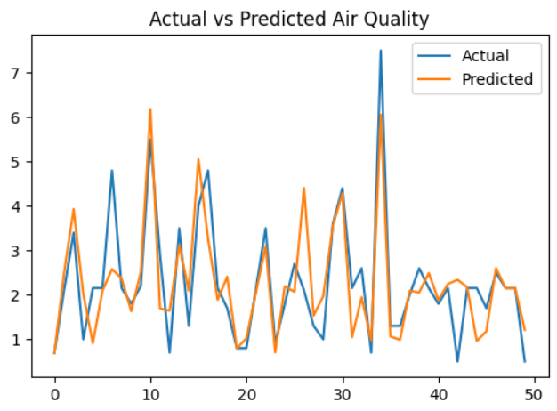
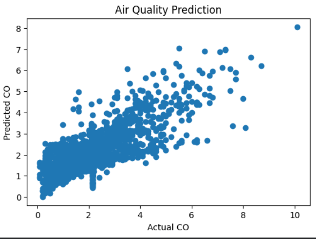

# Air Quality Prediction using Machine Learning

## Overview
This project predicts air pollution levels using machine learning 
based on environmental and sensor data. The model helps understand 
air quality trends and supports environmental monitoring.

## Dataset
Air Quality UCI Dataset

## Technologies Used
- Python
- Pandas
- NumPy
- Scikit-learn
- Matplotlib

## Model Used
Linear Regression

## Features Used
- NOx(GT)
- NO2(GT)
- Temperature
- Relative Humidity
- Absolute Humidity

## Evaluation Metrics
- MAE
- R2 Score
- RMSE

## Results

### Actual vs Predicted Air Quality
This graph compares actual and predicted air quality values.

### Scatter Plot of Prediction
This scatter plot shows relationship between actual and predicted values.

## Future Scope
- Apply Random Forest
- Apply Deep Learning
- Deploy model
- Add real-time prediction

## Author
Siddhi Malode
